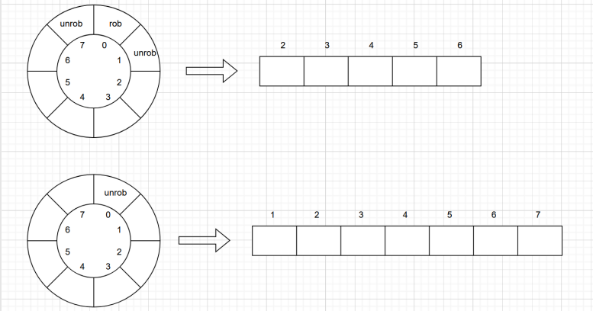

# 动态规划算法作业
王静初 2021K8009918003
## 第一题
### 题目
__Money Robbing__  
A robber is planning to rob houses along a street. Each house has a certain amount of money stashed, the only constraint stopping you from robbing each of them is that adjacent houses have security system connected and it will automatically contact the police if two adjacent houses were broken into on the same night.  
(a) Given a list of non-negative integers representing the amount of money of each house, determine the maximum amount of money you can rob tonight without alerting the police.  
(b) What if all houses are arranged in a circle?  
### 作答
#### 算法说明、最优子结构和DP方程
先考虑房子在直的街道上的情况。此时问题的输入为一个长度为n的数组money，money[i]表示第i个房子里有多少钱。  
用earn[i]表示从第一间房子开始到第i间房子最多能赚到的钱。每个房子只可能有两种状态：被打劫或不被打劫。如果第i间房子被打劫，那么第i-1间房子就不能被打劫，获得从前i-2间房子获得的钱加上第i间房子的钱。如果第i间房子不被打劫，那么获得的钱为从前i-1间房子得到的钱。最优子结构就是偷取前n-1个房屋和偷取前n-2个房屋的最大收益。  
可以得到转移方程：
> earn[n]=max{earn[n-2]+money, earn[n-1]}.

对于街道是环形的情况，由于不再存在“头”和“尾”的概念，可以随意选取一间房子，考虑对其打劫或不打劫的情况。如果打劫，则相邻的两间房子不能打劫，可以得到从剩下的房子（此时可以认为呈线性排布）偷取的最大收益加上打劫房子的钱。如果不打劫，则获得能从除这间房子之外其他房子（可视为线性排布）偷取的最大收益。即，可以转化为街道为直的情况。下图为选取的房子为0号时的情形。  

#### 伪算法
Algorithm 1: Money Robbing
```
function MaxMoneyLinear(money,n)
if (n==1) then 
    return money[0];
end if
earn[n];
earn[0]=money[0];
earn[1]=max{money[0], money[1]};
for i=2 to n-1 do:
    earn[i]=max{earn[i-2]+money[i]+earn[i-1]};
end for
return earn[n-1];
end function

```
```
function MaxMoneyCircle(money,n)
if (n==1) then 
    return money[0];
if (n==2) then
    return max{money[0],money[1]};
if (n==3) then
    return max{money[0],money[1],money[2]};
rob is a subset of money and rob equals to the elements of money starting from the third element up to the (n-1)th element; //rob包含第3到第n-1个元素
unrob is a subset of money and unrob equals to the elements of money starting from the second element; //unrob包含第2到第n个元素
return max{money[0]+MaxMoneyLinear(rob,n-3),MaxMoneyLinear(unrob,n-1)};
end function
```
#### 算法正确性证明
递归的正确性在算法说明中应该已经得到说明，不再赘述。本部分只证明初始化操作是正确的。  
线性时，如果只有一间房子可偷，显然偷它就好。如果有两间房子可偷，只能选择一间偷，需要选钱更多的那间。环形时，只有一间就只偷这间，只有两间或三间的情况都只能选择偷一间，需要选钱最多的那间。  
#### 算法复杂度
时间复杂度：仅需对数组遍历一遍，O(n).  
空间复杂度：最多只需两个数组保存数据（环形情况），O(n).  

## 第二题
### 题目
__Ugly Number__  
An ugly number is a positive integer whose prime factors are limited to 2, 3, and 5. Given an integer n, return the nth ugly number.  
(a) Using a brute-force algorithm to solve this problem, analyze the time complexity of your implemented brute-force algorithm and explain why the algorithm’s time complexity is O(n2), where n is the number of points.  
(b) Propose an improved algorithm to solve this problem with a time complexity better than the brute-force algorithm. Describe the algorithm’s idea and analyze its time complexity.
### 作答
#### (a)暴力算法
##### 算法说明
创建一个长度为n+1的数组ugly，ugly[i]表示第i个丑数。下标从0开始，初始化ugly[0]=1。计算每个ugly[i]值时，从前往后遍历三次：第一次将遍历得到的值乘2，如果发现比ugly[i-1]大就将乘积写入ugly[i]，退出遍历；第二次乘3，第三次乘5，如果发现要写入的结果比ugly[i]小就进行替换。ugly[n]的值即为所求。
##### 伪算法
Algorithm 2: Ugly Number
```
function UglyNumBrust(n)
ugly[n+1];
ugly[0]=1;

for i=1 to n do:
    num=0; j=0;

    while num<ugly[i-1] do:
        num=2*ugly[j++];
    end while
    ugly[i]=num;

    num=0;j=0;
    while num<ugly[i-1] do:
        num=3*ugly[j++];
    end while
    ugly[i]=min{ugly[i],num};

    num=0;j=0;
    while num<ugly[i-1] do:
        num=5*ugly[j++];
    end while
    ugly[i]=min{ugly[i],num};
end for

return ugly[n];
end function
```
##### 算法复杂度
主循环的时间复杂度是O(n)，因为它的迭代次数与输入参数n成正比。  
在主循环中，每个while循环的时间复杂度都是O(n)，因为在最坏情况下，需要迭代n次才能得到下一个丑数。这个while循环在主循环中有三次出现.  
因此，总的时间复杂度是 O(n^2)。  

#### (b)改进的算法
##### 算法说明、最优子结构和DP方程
观察上面的暴力算法。显然，每一次都从头找起是多余的，我们完全可以用指针记录上一次的位置，这样就可以只进行一次遍历，以节省时间开销。  
第n个丑数肯定是前n-1个数中某个数的2倍或3倍或5倍，维护三个指针搜寻前n-1个数中自身2/3/5倍恰好大于第n-1个数的数，且在下一次搜寻时接着上次搜寻的指针位置进行搜寻。  
最优子结构纪委前n-1个丑数。DP方程为：
> ugly[i]=min(2\*ugly[p2], 3\*ugly[p3], 5\*ugly[p5]).

##### 伪代码
```
function UglyNumImproved(n)
ugly[n+1];
ugly[0]=1;
p2,p3,p5=0;
for i=1 to n do:
    ugly[i]=min{2*ugly[p2], 3*ugly[p3], 5*ugly[p5]};
    if (ugly[i]==2*ugly[p2]) then p2++; end if
    if (ugly[i]==3*ugly[p3]) then p3++; end if
    if (ugly[i]==5*ugly[p5]) then p5++; end if
end for
return ugly[n];
end function
```
##### 算法正确性证明
初始化时，ugly[0] 被设置为 1，符合丑数的定义。  
在循环过程中，每次计算下一个丑数都是通过比较三个因子乘积的最小值得到的，因此 必然是符合丑数定义的数字。  
指针p2、p3和p5的更新保证了每个丑数都是按照从小到大的顺序计算得到的，没有遗漏也没有重复。  
##### 算法复杂度分析
时间复杂度：只需遍历一遍，O(n)。  
空间复杂度：只需一个数组和三个整型变量，O(n)。

## 第三题
### 题目
__Unique Binary Search Trees__  
Given n, how many structurally unique BST’s (binary search trees) that store values 1...n?  
Note: Given n = 3, there are a total of 5 unique BST’s.  
### 作答
#### 算法说明、最优子结构和DP方程
对于二叉搜索树来说，只要树的结点结构确定了，那么每个结点里能填的数字也就唯一地确定了。故，可以按树的左子树有多少个结点进行分类，即0,1,2,...,n-1（根结点已经占了一个结点）。对应地，树的右子树分别有n-1,n-2,n-3,...,0个结点。那么结点数为n的不同构二叉搜索树数量dp[n]即为
> $dp[n]=\sum_{i=0}^{n-1}dp[i]*dp[n-1-i]$

最优子结构是前面0到n-1个节点的不同构二叉树的数目。本题的答案是卡特兰数。

#### 伪代码
Algorithm 3: Unique Binary Search Tree
```
function UniqueTree(n)
dp[n+1];
dp[0]=1;
dp[1]=1;
for i=2 to n do:
dp[i]=0;
for j=0 to i-1 do:
dp[i]+=dp[j]*dp[i-1-j];
end for
end for
return dp[n];
end function
```
#### 正确性证明
对于一个结点的情况，显然只有一种二叉搜索树。  
两个或以上节点情况下，两个二叉搜索树不同构等价于根节点左右子树之一不同构，所以对于左右子树根节点数目分类，计算不同结点数下不同构的左右子树的数量，根据组合数学的原理，对其相乘即为该结点数目情况下不同构二叉搜索树的数目，最后累加即可。

#### 算法复杂度
数组双重循环，时间复杂度为O(n^2)，空间复杂度为O(n)。  
如果已知是卡特兰数并使用公式C[n] = (2n)! / ((n+1)! \* n!)进行计算，时间复杂度可降为O(n)，空间复杂度仍为$O(n)$.

## 第四题
### 题目
__Largest Divisible Subset__  
Given a set of distinct positive integers, find the largest subset such that every pair (Si, Sj ) of elements in this subset satisfies: Si%Sj = 0 or Sj %Si = 0. Please return the largest size of the subset.  
Note: Si%Sj = 0 means that Si is divisible by Sj .
### 作答
#### 算法说明、最优子结构和DP方程
设输入为nums[n]，下标从零开始。先对nums按从小到大进行排序，使nums[i]%nums[j]当且仅当i>j。创建数组dp，dp[i]表示nums[0:i]的最长可除子集长度。从0到i-1遍历，如果nums[i]是nums[j]的倍数（0<=j<i）且dp[j]+1>dp[i]，那么就更新dp[i]为dp[j]+1。  
最优子结构就是前n-1个数的最长可除子集长度。  
DP方程为：
> $dp[i]=1+\max_{0 \leq j \leq i} dp[j]$
#### 伪算法
Algorithm 4: Largest Divisible Subset
```
function LargestDivisibleSubset(nums,n)
sort(nums);
dp[n];
dp[0]=1;
maxlen=1;
for i=1 to n-1 do:
    dp[i]=1;
    for j=0 to i-1 do:
        if (nums[i]%nums[j]&&dp[j]+1>dp[i]) then
            dp[i]=dp[j]+1;
        end if
    end for
    maxlen=max{maxlen,dp[i]};
end for
return maxlen;
end function
```
#### 正确性证明
假设有两个元素nums[i]和nums[j]，其中i > j，并且nums[i]可以整除nums[j]。那么，我们可以将nums[i]加入以nums[j]为最后一个元素的最长可整除子集中，形成一个更长的子集。因此，dp[i]必然大于等于dp[j] + 1。最大的dp值就是所求答案。

#### 算法复杂度
时间复杂度：排序的复杂度为O(nlogn)，计算maxlen的复杂度为O(n\^2)（数组双层循环），总的时间复杂度为O(n\^2).  
空间复杂度：O(n)。

## 第五题
### 题目
__Target Sum__  
You are given an integer array nums and an integer target.  
You want to build an expression out of nums by adding one of the symbols ’+’ and ’-’ before each integer in nums and then concatenate all the integers.  
For example, if nums = [2, 1], you can add a ’+’ before 2 and a ’-’ before 1 and concatenate them to build the expression ”+2-1”.  
Return the number of different expressions that you can build, which evaluates to target.  
Example:  
Input: nums = [1,1,1,1,1], target = 3  
Output: 5  
Explanation: There are 5 ways to assign symbols to make the sum of nums be target 3.  
-1 + 1 + 1 + 1 + 1 = 3  
+1 - 1 + 1 + 1 + 1 = 3  
+1 + 1 - 1 + 1 + 1 = 3  
+1 + 1 + 1 - 1 + 1 = 3  
+1 + 1 + 1 + 1 - 1 = 3  
### 作答
#### 算法说明、最优子结构和DP方程
首先计算数组nums中所有元素的总和sum，如果sum大于目标值target的绝对值，则直接返回0。  
定义一个二维数组dp，其中dp[i][j]表示前 i 个元素能否组合成和为j-(sum)的情况数。从i = 1开始，依次遍历数组nums中的每个元素，对于每个元素，遍历dp数组中上一行不为0的位置，并在当前行dp[i]中更新这些位置的值。具体做法是：如果上一行中位置 (i-1, j) 不为 0，则在当前行中位置(i, j+nums[i])和(i, j-nums[i])分别加上上一行位置(i-1, j)的值。最终返回 dp[n-1][target+sum] 即可。  
最优子结构：在计算 dp[i][j] 的时候，我们只需要关注前一个位置的值 dp[i-1][j]，而不需要知道 dp[0..i-2][0..j] 的情况。这意味着，我们可以通过前一个位置的状态推导出当前位置的状态，这符合动态规划的最优子结构性质。  
DP方程：dp[i][j] = dp[i-1][j-nums[i]]+dp[i-1][j+nums[i]]。  

#### 伪代码
$Algorithm 5: Target Sum$
```
function TargetSum(nums,target)
n=len(nums);
if (n==0) then return 0;
sum=0;
for i=0 to n-1 do:
	sum+=nums[i];
end for
if (sum>abs(target)) then return 0;
dp[n][2*sum+1]={{0}}; //初始化为0
dp[0][sum+nums[0]]+=1;
dp[0][sum-nums[0]]+=1;
for i=1 to n-1 do:
	for j=0 to 2*sum do:
		if (dp[i-1][j]>0) then
			dp[i][j+nums[i]]+=dp[i-1][j];
			dp[i][j-nums[i]]+=dp[i-1][j];
		end if
	end for
end for
return dp[n-1][sum+target];
end function
```
#### 正确性证明
证明DP方程正确：假设第n个数为k，那么前n-1个数需要合成到target-k或target+k才能使最终的结果为target。  

#### 算法复杂度
时间复杂度为O(n\*sum)，优于使用递归法的O(2\^n)。
```
function TargetSumRecursion(nums,target) //递归法
n=len(nums);
if (n==0) then return 0;
if (n==1) then return nums[0]==abs(target);
sub is a subset of nums and sub equals to the first n-1 elements of nums;
return TargetSumRecursion(sub,target+nums[n-1])+TargetSumRecursion(sub,target-nums[n-1]);
end function
```
空间复杂度为O(n\*sum)。可以改进dp结构，使其只有两列，一列保存上一次的结果，一列保存本次结果，可使空间复杂度降到O(sum)。这样的话，时间复杂度会上升一些，但仍为O(n\*sum)。
```
function TargetSumImproved(nums,target) //改进的方法，空间复杂度为O(sum)
n=len(nums);
if (n==0) then return 0;
sum=0;
for i=0 to n-1 do:
	sum+=nums[i];
end for
if (sum>abs(target)) then return 0;
dp[2][2*sum+1]={{0}}; //仅使用两列
dp[0][sum+nums[0]]+=1;
dp[0][sum-nums[0]]+=1;
for i=1 to n-1 do:
    for j=0 to 2*sum do:
        if (dp[0][j]>0) then
            dp[1][j+nums[i]]+=dp[0][j];
            dp[1][j-nums[i]]+=dp[0][j];
        end if
    end for
    for j=0 to 2*sum do:
        dp[0][j]=dp[1][j];
        dp[1][j]=0;
    end for
end for
return dp[0][sum+target];
end function
``````