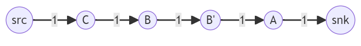
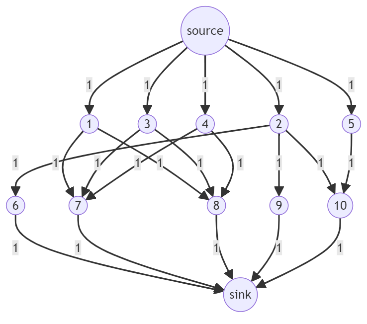
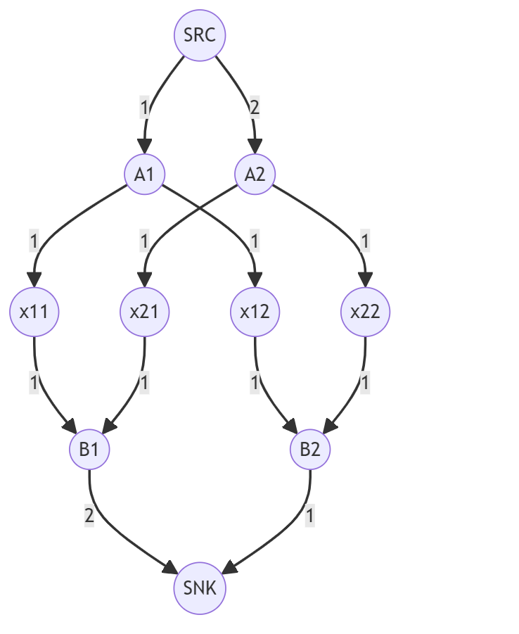

# 网络流算法作业
2021K8009918003 王静初
## 第一题
图给的顶点是ABCD，但题目说源点是4，汇点是3。为统一，把ABCD用1234表示。  
### LP方程
一道最经典的网络流。如果仅需列出LP方程的话：  
$x_{ij}$表示从点i到点j可能运输的额度，就本题来说可能不为0的$x_{ij}$仅有$x_{13}、x_{21}、x_{23}、x_{42}$和$x_{43}$。  
$max \qquad f \qquad s.t.$  
$x_{42}+x_{43}=f$  
$x_{13}+x_{23}+x_{43}=f$  
$x_{21}-x_{13}=0$  
$x_{42}-x_{21}-x_{23}=0$  
$x_{21}-x_{13}=0$  
$0\leq x_{13}\leq 30$  
$0\leq x_{21}\leq 30$  
$0\leq x_{23}\leq 20$  
$0\leq x_{42}\leq 30$  
$0\leq x_{43}\leq 20$   
### Dinic算法求最大流
Dinic算法主要分为两部分：BFS和DFS。BFS用于构建层次图，DFS用于在层次图上寻找增广路径并更新残余图。首先通过BFS构建层次图，然后在层次图上使用DFS寻找增广路径，并更新残余图的边权值。重复这个过程直到无法找到增广路径为止，最终得到网络流的最大流量。  
```
function BFS(ResidualGraph, source, sink, level)
    for each node in ResidualGraph
        level[node] = -1
    level[source] = 0
    queue.enqueue(source)
    while queue is not empty
        current = queue.dequeue()
        for each neighbor of current in ResidualGraph
            if level[neighbor] < 0 and ResidualGraph[current][neighbor] > 0
                level[neighbor] = level[current] + 1
                queue.enqueue(neighbor)

function DFS(ResidualGraph, current, sink, level, flow)
    if current == sink
        return flow
    for each neighbor of current in ResidualGraph
        if ResidualGraph[current][neighbor] > 0 and level[neighbor] == level[current] + 1
            new_flow = min(flow, ResidualGraph[current][neighbor])
            new_flow = DFS(ResidualGraph, neighbor, sink, level, new_flow)
            if new_flow > 0
                ResidualGraph[current][neighbor] -= new_flow
                ResidualGraph[neighbor][current] += new_flow
                return new_flow
    return 0

function DinicMaxFlow(Graph, source, sink)
    maxFlow = 0
    level = new array
    while true
        BFS(Graph, source, sink, level)
        if level[sink] < 0
            break
        while true
            flow = DFS(Graph, source, sink, level, INF)
            if flow <= 0
                break
            maxFlow += flow
    return maxFlow

```
## 第二题
通过网络流算出最大流，这个最大流就是一次最多可以通过的人数m。将总人数7除以m，向上取整得到的b就是需要的批次。  
### LP方程
用123456代表abcdef。  
$x_{ij}$表示从点i到点j可能运输的额度，就本题来说可能不为0的$x_{ij}$仅有$x_{12}、x_{14}、x_{23}、x_{36}、x_{43}、x_{45}$和$x_{56}$。  
$max \qquad f \qquad s.t.$  
$x_{12}+x_{14}=f$  
$x_{36}+x_{56}=f$    
$x_{12}-x_{23}=0$  
$x_{23}+x_{43}-x_{36}=0$  
$x_{14}-x_{43}-x_{45}=0$  
$x_{45}-x_{56}=0$  
$0\leq x_{12}\leq 1$  
$0\leq x_{14}\leq 2$  
$0\leq x_{23}\leq 1$  
$0\leq x_{36}\leq 2$  
$0\leq x_{43}\leq 1$  
$0\leq x_{45}\leq 1$   
$0\leq x_{56}\leq 1$   
## 第三题
把学生分为三类：回家的学生A，不回家的学生B，和外校学生C。很显然，如果A类人数比C类人数少，则一定不能满足。如果真的需要设计一种算法，这一类情况可以直接判断。  
可以把这个床位问题转化成一个网络流最大流问题。首先每个学生不论类别都有一个代表他们自己的结点。设置一个源点指向所有C类学生，一个汇点被所有A类学生指向。  
对C类学生，如果他们认识一个A类或B类学生，则向他们伸出一条边。对于B类学生$B_{i}$，他们会有一条边指向结点$B'_{i}$。如果B类学生$B_{i}$认识其他B类或A类的学生，则从$B'_{i}$结点向他们伸出一条边。  
所有边的权值都设置为1，只需要将最大流与C类学生人数比较，如果相等就是可满足，否则不满足。  
以题目中给的例子为例：
|1|1|0|
|-|-|-|
|0|1|0|
|0|1|1|
|1|0|0|
|1|0|0|  

构建出来的图是这样的：  
  
实际上，如果只考虑三个人的情况，用网络流有点“杀鸡焉用牛刀”的意思，毕竟直接枚举都可能更省事。但如果人数很多，用网络流应该会是一种比较可行的方法。  
## 第四题
可以转换成网络流问题。  
每个飞行员对应一个点。设置一个源点指向所有外国飞行员，一个汇点被所有英国飞行员指向。如果外国飞行员i认识英国飞行员j，则构建从结点i到结点j的一条边。每条边的权值都是1。求出最大流后，最大流即是最大匹配数，所有用到的“认识”边连接的一组飞行员就是最佳匹配。  
以给出的数据为例：
|1|7|
|-|-|
|1|8|
|2|6|
|2|9|
|2|10|
|3|7|
|3|8|
|4|7|
|4|8|
|5|10|

构造出来的图这样的：

## 第五题
可以把问题转化成网络流问题。假设有m行n列，则每个需要填的格子为一个顶点。对于每行（假设是第i行），有一个顶点$A_{i}$指向行中每个结点。对于每列（假设是第j列），有一个结点$B_{j}$被列中每个结点指向。这里每条边的权值都是1。设置源点指向$A_{i}$，且指向$A_{i}$的边的权值为第i行的数值总和。设置汇点被$B_{j}$指向，且由$B_{j}$伸出的边的权值为第j列的数值总和。
以如下数据为例：
|1|0|
|-|-|
|1|1|

| |1|2|
|-|-|-|
|row sum|1|2|
|col sum|2|1|

构造出的图是这样的：
  
算出最大流后，如果有选择的边经过$x_{ij}$，则令$x_{ij}$为1，否则为0。这样即可得到一种解。

<script type="text/javascript" src="http://cdn.mathjax.org/mathjax/latest/MathJax.js?config=TeX-AMS-MML_HTMLorMML"></script>
<script type="text/x-mathjax-config">
  MathJax.Hub.Config({ tex2jax: {inlineMath: [['$', '$']]}, messageStyle: "none" });
</script>